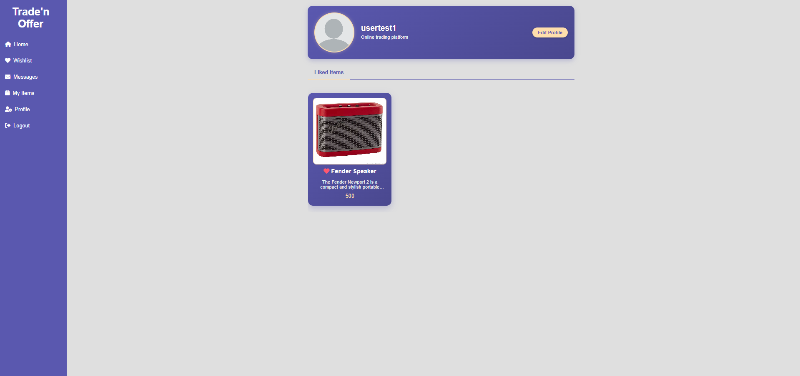

# Trade'n Offer
**Course:** 01286232 Software Engineering Principles  
**Program:** Software Engineering Program
* Parin Vessakosol (66011123) Frontend Developer
* Phurinat Punmerod (66011580) Backend Developer
* Jirawatt Chimmanee (66011008) Backend Developer

## Project Description
**Trade'n Offer** is a web-based application designed to redefine the concept of item exchanges by incorporating an Instagram-like feed for item discovery. Users can browse through a continuous stream of items, interact with listings they're interested in, and connect with other users to trade or purchase items. The platform delivers a familiar social media experience but focused on item trading and commerce.

## Features by Page
### Home Page
* Swiping interface for browsing available items.
* Item cards with detailed information and images.
* Intuitive like system for expressing interest.
* Real-time updates of new available items.
* User profile access and notifications display.

## Features
* **Item Trading System**: Trade items directly instead of selling or purchasing them with money
* **Real-Time Chat**: Communicate instantly with matched users via Firebase messaging
* **Purchase Functionality**: Option to buy items directly if the owner has enabled purchasing
* **User Profiles**: Manage trade items, keep track of favorites, and explore available items
* **Interactive UI**: Intuitive swiping interface to express interest in items

## Technology Stack
### Backend
* **FastAPI** (Python): Handles API development and trade logic processing
* **ZODB** (Zope Object Database): Flexible object storage for managing item metadata
* **MySQL**: Structured data storage for user profiles, trade histories, and item listings
* **SQLAlchemy**: ORM for database management

### Frontend
* **PyScript**: Python embedded in HTML for interactivity and real-time UI updates
* **HTML/CSS**: Responsive UI design with CSS animations
* **Font Awesome**: Icon library for UI elements

### Real-Time Features
* **Firebase**: Handles real-time chat messages and notifications

### Database Architecture
* **Relational Database (MySQL)**: Used for structured data storage including user accounts, item listings, trade offers, and wishlist management
* **Firebase Realtime Database**: Implemented for real-time chat functionality, storing message history and enabling instant communication between matched users
* **ZODB Object Database**: Utilized for storing complex item metadata including images and detailed item conditions

## 📋 Project Structure
The project is organized into two main directories:

### Backend
* **API Routes**: Endpoints for authentication, item management, trade offers, wishlist, etc.
* **Models**: Database schemas and object models for items and trades
* **Services**: Firebase integration for real-time chat

### Frontend
* **Templates**: HTML templates for different pages (login, trade offers, profile, etc.)
* **Static**: CSS styling and PyScript code for frontend logic
* **Components**: Reusable UI components like chat interfaces and item cards

## Screen Captures

* Home Page
  
  

* Chat Interface
  
  

* User Profile
  
  

* My Items Management
  
  
